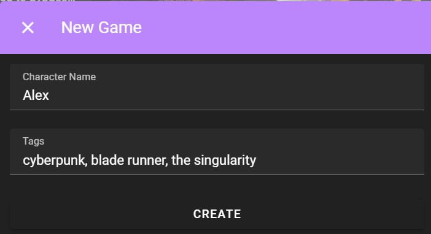
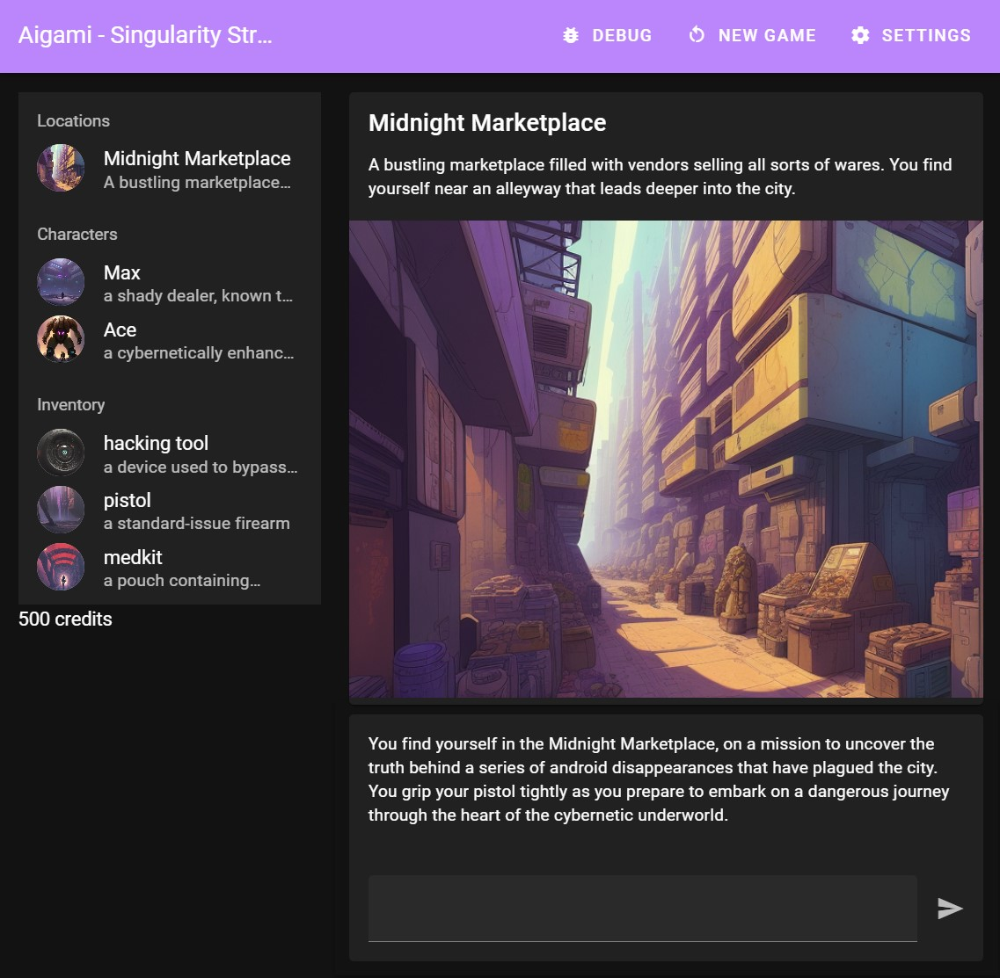
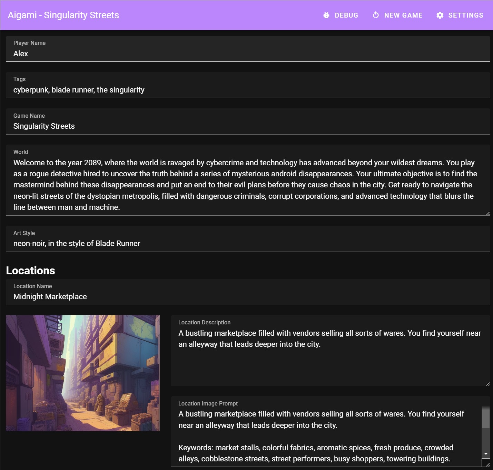
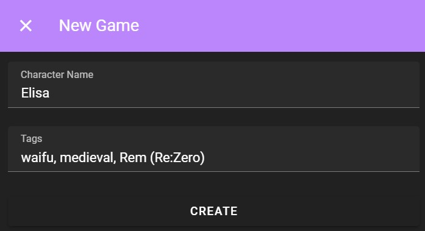
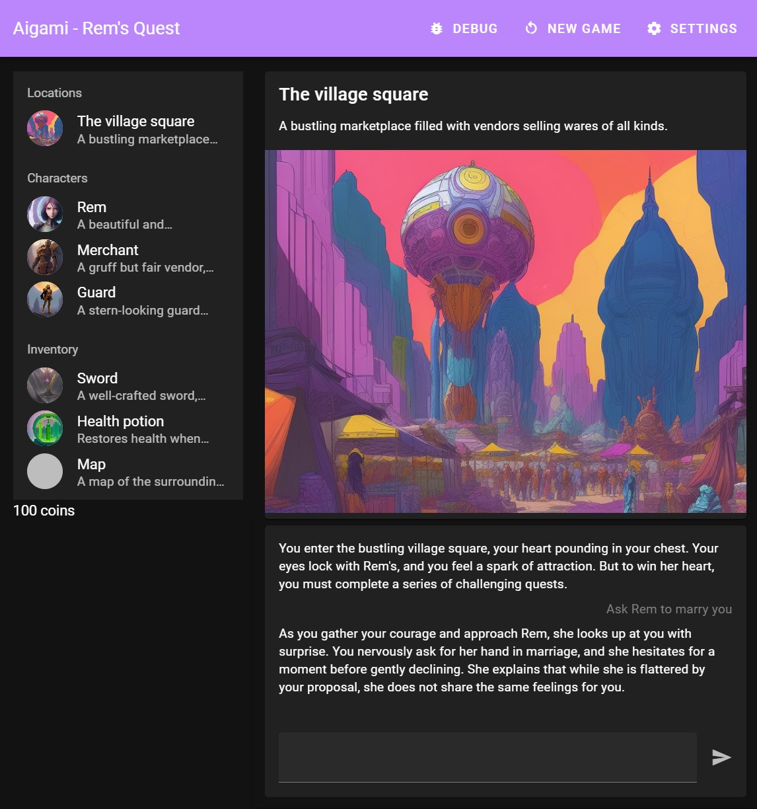

# Aigami Text Adventure Game

Given a few tags, Aigami builds a game just for you. Using OpenAI ChatGPT3.5 to create the game and to handle the text adventure side of things. Using BrainPet API to render images for locations, characters and inventory items.

OpenAI might give you some free credits for the API? BrainPet gives you 100 free credits (500 basic images). So this should run on any device with internet and a browser.

This is still a work in progress... it doesn't work fully yet.

Demo is available here: https://boringcrypto.github.io/aigami-vue/

## Project setup

```
yarn
```

### Compiles and hot-reloads for development

```
yarn dev
```

### Compiles and minifies for production

```
yarn build
```

## Examples







